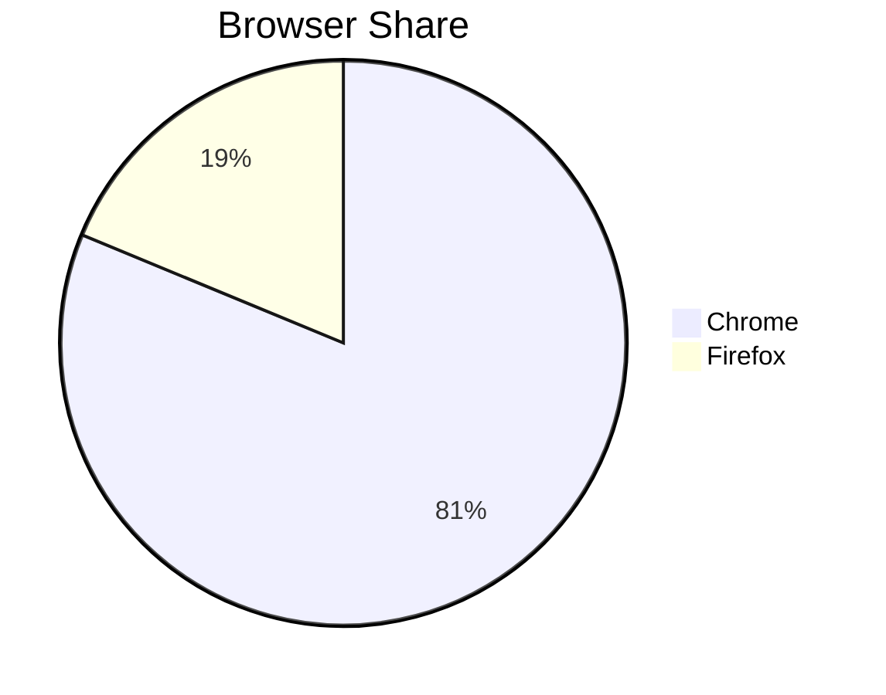
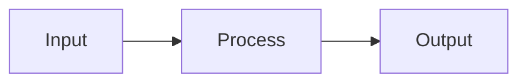

# Authoring Markdown for doc-to-dashboard

The doc-to-dashboard viewer renders `.md` files with extra structure: front matter cards, Mermaid diagrams, KaTeX math, semantic callouts, sortable tables, glossary grouping, and footnotes. This guide describes exactly what is supported so docs render cleanly.

## Decision flow when writing a new doc

1. **Start with front matter** if you want title/description/tags cards.
2. **Pick the right block for the content type** — diagrams → Mermaid, math → KaTeX, structured key/value lists → glossary, side-notes → callouts.
3. **Avoid the listed gotchas** (parentheses in quadrant labels, semicolons in sequence notes, mixed image+text paragraphs).
4. **Don't reach for HTML.** Raw HTML is not a supported escape hatch — stick to the constructs below.

---

## 1. Front Matter

YAML, must be the very first thing in the file:

```markdown
---
title: "My Document"
description: "A brief description"
tags: ["tag1", "tag2"]
author: "Author Name"
---
```

- `title`, `description`, `tags` (or `keywords`) get special card rendering.
- Any additional key/value pairs render as metadata cards.
- Optional, but if present must come before all other content.

## 2. Headings

Standard `#` through `######`. All headings get auto-generated slug anchor IDs and appear in the TOC sidebar.

## 3. Inline formatting

| Syntax | Result |
|---|---|
| `**bold**` / `__bold__` | bold |
| `*italic*` / `_italic_` | italic |
| `~~strike~~` | strikethrough |
| `` `code` `` | inline code |
| `[label](url)` | link (opens in new tab) |
| `$expr$` | inline KaTeX math |
| `text[^id]` | footnote reference |

## 4. Mermaid Diagrams

Two equivalent forms:

**A. Generic `mermaid` block** (diagram type on line 1):

````markdown

````

**B. Diagram type as the language identifier** (type prepended automatically):

````markdown
```pie
title Browser Share
  "Chrome" : 65
  "Firefox" : 15
```
````

Supported language identifiers: `mermaid`, `flowchart`, `sequencediagram`, `classdiagram`, `erdiagram`, `statediagram` / `statediagram-v2`, `gantt`, `pie`, `mindmap`, `timeline`, `sankey-beta`, `xychart-beta`, `quadrantchart`, `block-beta`, `gitgraph`.

### Mermaid gotchas

- **quadrantChart point labels**: parentheses are stripped before render. Write `Point A` not `Point A (detail)`.
- **sequenceDiagram notes**: semicolons inside `Note` / `Note over` text are auto-replaced with commas. Don't rely on literal semicolons there.
- Diagrams auto-theme to dark/light. Don't hardcode colors unless required.

## 5. Math (KaTeX)

**Display math** — `$$` on their own lines:

```markdown
$$
x = \frac{-b \pm \sqrt{b^2 - 4ac}}{2a}
$$
```

**Inline math** — single `$`: `The slope is $m = \frac{\Delta y}{\Delta x}$.`

If an expression fails to parse, the renderer falls back to code formatting — escape `$` as `\$` in prose where needed.

## 6. Code Blocks

Fenced blocks with an optional language identifier (highlight.js, 200+ languages):

````markdown
```python
def greet(name: str) -> str:
    return f"Hello, {name}!"
```
````

A copy button and language badge are added automatically. Omit the language for plain text.

## 7. Tables (GFM)

```markdown
| Name | Role | Score |
|------|------|------:|
| Alice | Engineer | 95 |
| Bob | Designer | 87 |
```

- Alignment via `:---`, `:---:`, `---:` in the separator row.
- Headers are clickable to sort (asc → desc → none); numeric vs text is auto-detected.
- Tables scroll horizontally on small screens.

## 8. Blockquote Callouts

Plain `>` blockquotes work, plus GitHub-style semantic markers:

```markdown
> [!NOTE]
> General informational note.

> [!TIP]
> Helpful suggestion.

> [!WARNING]
> Potential issue or pitfall.

> [!IMPORTANT]
> Critical information.
```

| Variant | Color |
|---|---|
| `[!NOTE]` | Blue |
| `[!TIP]` | Teal |
| `[!WARNING]` | Orange |
| `[!IMPORTANT]` | Purple |
| *(none)* | Default |

The `[!TYPE]` marker line is hidden in output. Inline formatting works inside.

## 9. Lists & Task Lists

Unordered, ordered, and `- [x]` / `- [ ]` task lists all render. Arbitrary nesting is supported.

## 10. Images

Images **must be standalone** — their own paragraph, no surrounding text — to render as a figure with caption:

```markdown

```

The `"title"` segment becomes the visible caption. Mixing an image with adjacent text in the same paragraph drops it to inline HTML and skips the figure styling.

## 11. Glossary

Consecutive paragraphs of the form `**Term**: definition` are auto-grouped into a definition list:

```markdown
**API**: Application Programming Interface.

**REST**: Representational State Transfer.

**JSON**: JavaScript Object Notation.
```

Allowed separators: `:`, em dash `—`, en dash `–`. The term must be in `**bold**`. Any non-paragraph element (heading, code block, etc.) ends the group.

## 12. Footnotes

```markdown
The web uses HTTP[^1] and TLS[^tls] for secure communication.

[^1]: Hypertext Transfer Protocol.
[^tls]: Transport Layer Security.
```

IDs can be numeric or text. Definitions render in a single Footnotes section at document end regardless of where you place them.

## 13. Horizontal Rules

`---`, `***`, or `___` — all produce a divider.

## 14. Recognized but not rendered

These language identifiers are detected but currently show the raw source with a "rendering not yet supported" notice:

| Language | Tool |
|---|---|
| `plantuml` | PlantUML |
| `dot` | GraphViz |
| `graphviz` | GraphViz |

Prefer Mermaid equivalents until these ship.

---

## Quick sanity checklist before saving

- [ ] Front matter (if any) is at the very top, fenced by `---`.
- [ ] Each Mermaid block has a valid diagram type on its first content line.
- [ ] No parentheses in quadrantChart point labels.
- [ ] No semicolons inside sequenceDiagram `Note` text.
- [ ] Display math uses `$$` on their own lines (not inline).
- [ ] Images intended as figures sit alone in their paragraph.
- [ ] Glossary terms are wrapped in `**…**` and use `:`, `—`, or `–`.
- [ ] Every `[^id]` reference has a matching `[^id]: …` definition.

## Minimal template

```markdown
---
title: "Document Title"
description: "One-line summary"
tags: ["topic"]
---

# Document Title

Intro paragraph.

## Section

> [!NOTE]
> Context the reader needs up front.



## Reference

| Field | Type | Notes |
|---|---|---|
| `id` | string | Primary key |

[^1]: Footnote text.
```
